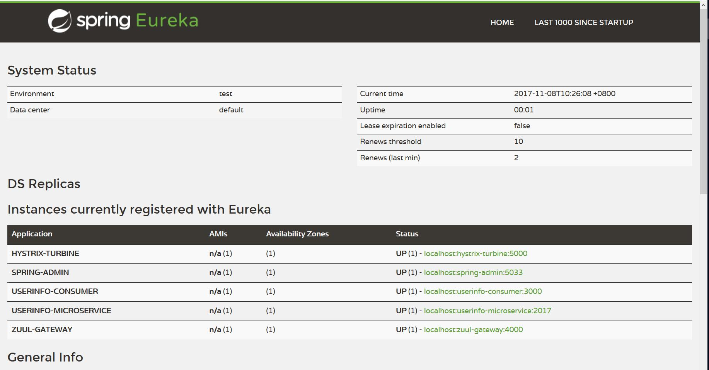
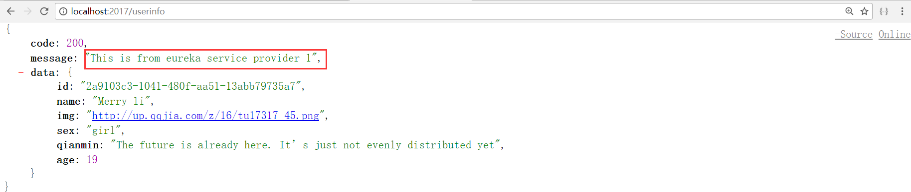
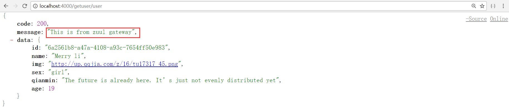
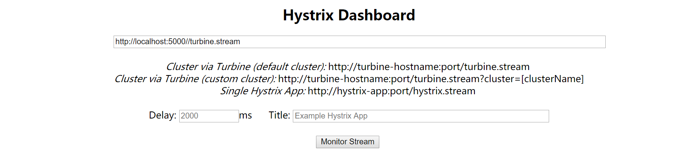
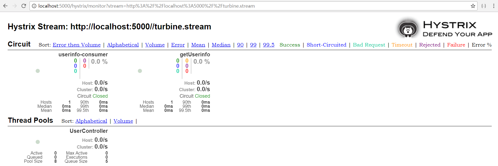
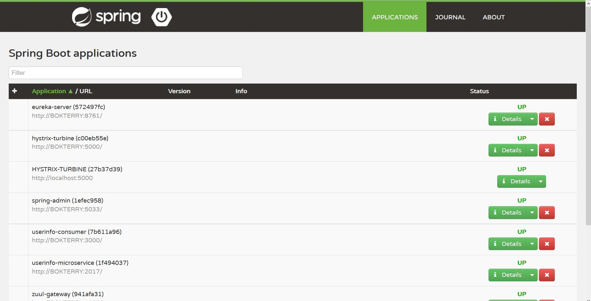
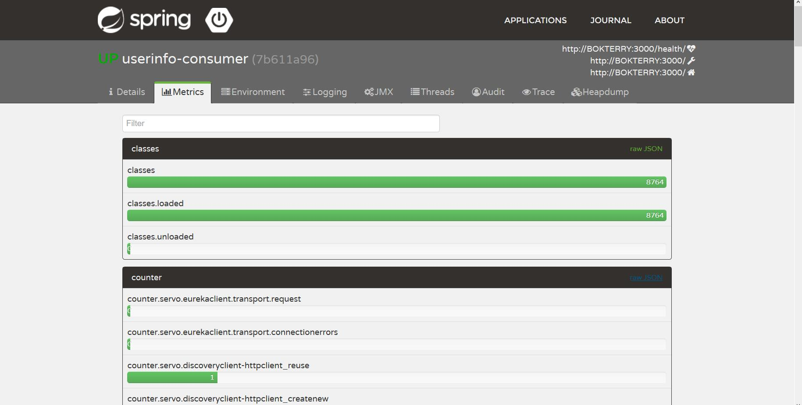

# Spring Cloud Netflix 分布式微服务实践

基于美国Netflix公司开源的分布式应用开发框架，
使用Eureka做服务注册发现，Feign做服务调用，Zuul微服务网关，Ribbon负载均衡，
Hystrix服务容错保护/断路器，admin服务管控

### eureka-server 服务注册中心

运行服务，打开 http://localhost:8761/

看到注册有5个服务

### server-provider 服务提供者

在2017端口提供了一个查询用户信息的API

访问http://localhost:2017/userinfo

### feign-consumer 服务消费者

消费服务userinfo-microservice

访问 http://localhost:3000/user 

返回结果

### zuul-gateway 微服务网关

用serviceId代替URL，实现动态路由

网关路由到userinfo-consumer的接口，返回结果被Zuul过滤器替换

访问 http://localhost:4000/getuser/user

### hystrix-turbine 服务监控

打开 http://localhost:5000/hystrix

填入`http://localhost:5000//turbine.stream`查看服务运行状态

### admin-server 服务管控

打开 http://localhost:5033

