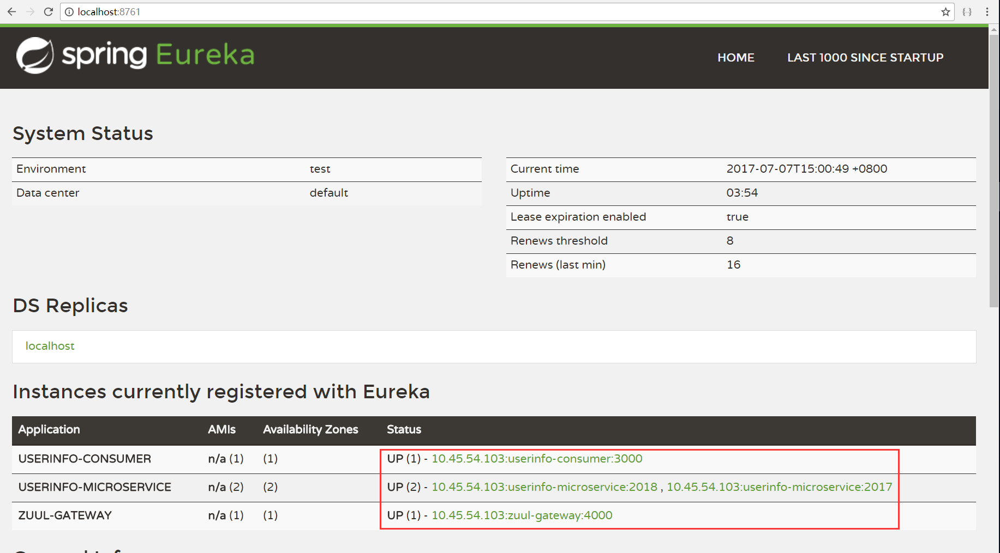

## Spring Cloud Netflix 分布式微服务实践

Eureka服务注册发现，Feign服务调用，Zuul微服务网关，Ribbon负载均衡/故障切换，Hystrix服务容错保护

### Eureka Server 服务注册中心，管理服务注册和发现

运行服务，打开http://localhost:8761/

看到注册有三个服务，其中userinfo-microservice有两个实例

### Eureka Service provider 服务提供者

运行两个实例，在2017和2018端口提供了一个查询用户信息的API

访问http://localhost:2017/userinfo 或 http://localhost:2018/userinfo

### Eureka Service consumer 服务消费者

消费服务userinfo-microservice

访问 http://localhost:3000/user 

返回结果

### Zuul Service gateway 微服务网关

用serviceId代替URL，实现动态路由

网关路由到userinfo-consumer的接口，返回结果被Zuul过滤器替换

访问 http://localhost:4000/getuser/user

### Hystrix Turbine 服务监控

打开 http://localhost:5000/hystrix

填入 http://localhost:5000//turbine.stream 查看服务运行状态

